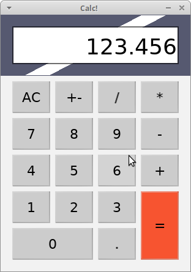

# Калькулятор, написанный на LOVE

А почему бы и нет? Несмотря на то, что [LOVE](https://love2d.org/) это игровой движок, 
почему бы на нём не написать калькулятор? Красивый и с кнопками!



Для запуска установите LOVE, скачайте репозиторий, перейдите в папку с main.lua и выполните:

```bash
love .
```

## Особенности

Калькулятор поддерживает ввод с клавиатуры и клики мышкой. В работе похож на 
обычный настольный калькулятор (насколько автор помнил, как они работают). 
